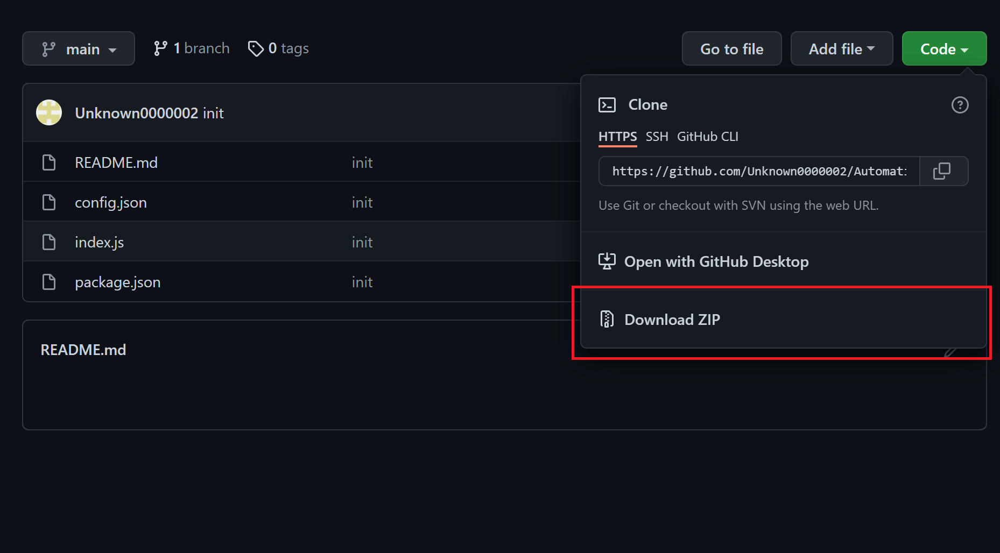
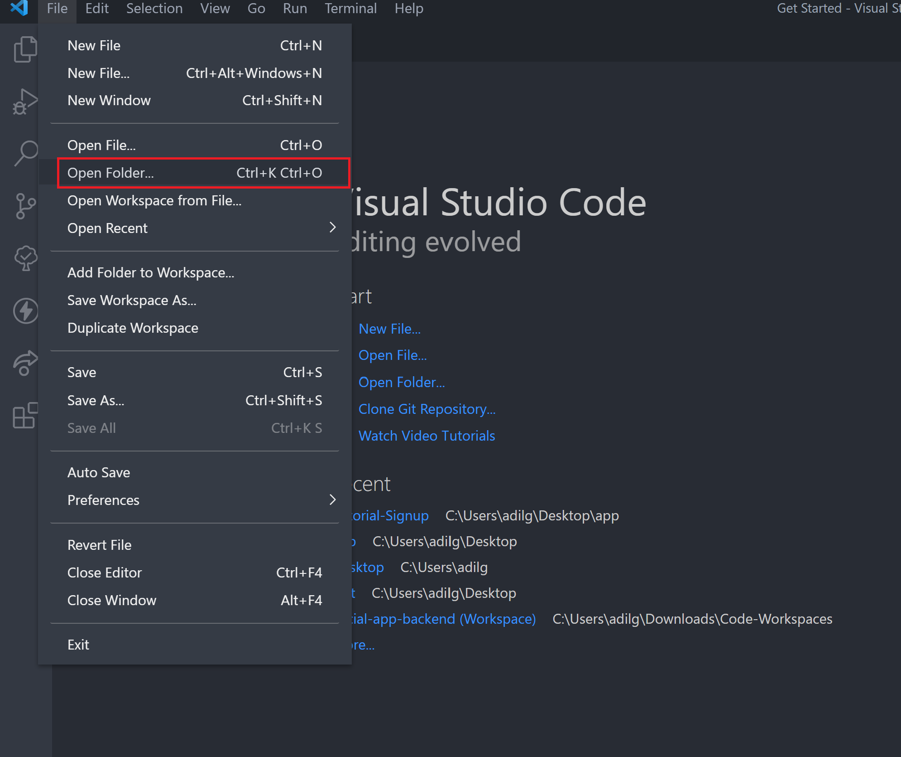
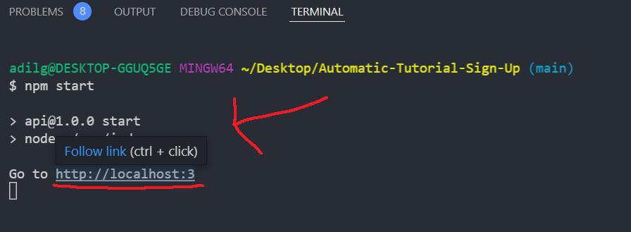
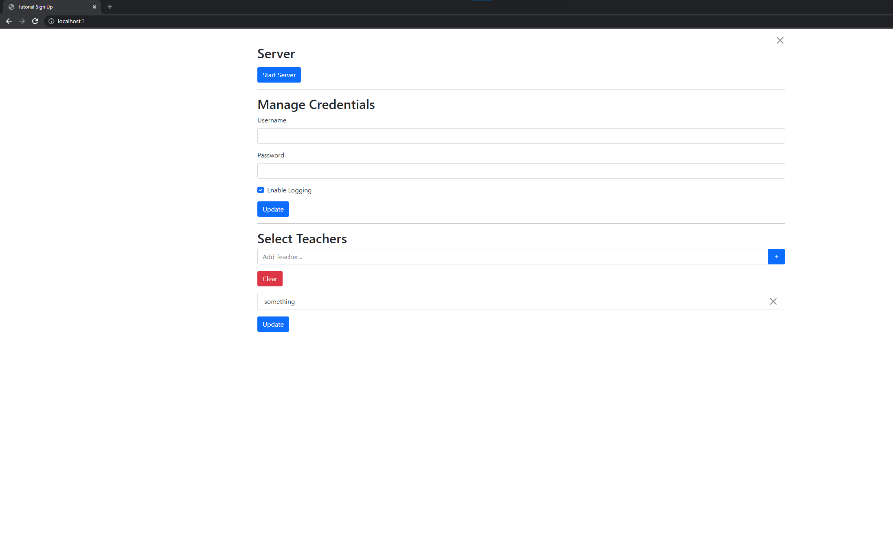
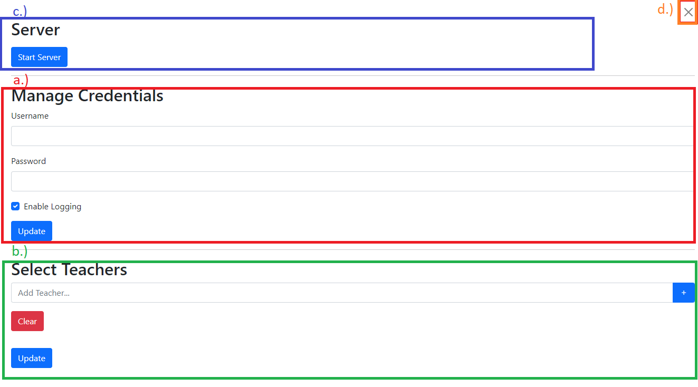

# Automatic Tutorial Sign Up

**Notice:** Read the **FULL** directions, or you will have a hard time knowing what is going on.

## About

This package allows you to sign up automatically to your preferred teacher's tutorial.

**There is only support for Homework/Study Hall Tutorials.**

## Why I Created It

I was bored.

## How It Works

This project allows you to automate signing up for homework/study hall. All the information from the localhost page is stored in the `config.json` file. The localhost page is there to make configuring more user friendly, but if you feel more comfortable you can edit the `config.json` directly.

The project first uses your credentials to login into your account so it can actually sign up for the tutorials. Once logged in, it will run through the schedule and find all the tutorials that have your preferred teachers. From there it will try to sign up for those tutorials. If enable logging is on, it will give you information on which tutorials you are signed up for. It will keep trying to sign you up in intervals.

## Common Errors

- You did not enter valid credentials.
- Captcha Error: You tried to use invalid credentials and now infinite campus thinks your trying to hack someone's account. To fix, go to the infinite campus website and login from there and complete the captcha.
- The process ended on purpose. Likely, some human error. Read the output in the terminal for further directions. If it says "Error has occurred," run the project again. If it still gives the same output then delete the project you are using and install the project again from the [repository](https://github.com/Unknown0000002/Automatic-Tutorial-Sign-Up).
- You did not install the dependencies required to run the project. Execute `npm i` to install them.

## Some Stuff To Know

- This project only signs up for homework/study hall tutorials. When it comes to selecting homework tutorials, it is not 100% accurate, so I advise you to keep checking.

- Your credentials are **ONLY** stored in the `config.json` and will only be used to login to the infinite campus website.

## Set Up

Follow these steps to set up the project. The set up might seem really long, but it only takes about 4 minutes to complete.

\*Some of the shortcuts might use `Cmd` instead of `Ctrl` on mac.

1. Download and install the latest version of [Node.js]('https://nodejs.org'). This software is what allows this code to run.

2. Download and install [vscode]('https://code.visualstudio.com). This will help you setup and install the project.

3. Download the files as a zip from the repository.

4. Extract the zip file. Locate the files extracted. Then delete the zip file.

5. Next open vscode. From there in the Visual Studio Code menu bar, choose File > Open > Folder, or use the shortcut `Ctrl + K Ctrl + O`. Then browse to the extracted files' location.

6. Then, open the terminal in vscode by going to View > Terminal or using the shortcut `` Ctrl + ` ``.

7. In the terminal type `npm i`. This command will install the dependencies needed in order for this code to run.

8. Next, run `npm start`. In the terminal, a link to localhost should show up. `Ctrl + Click` on the link in the terminal or just manually enter the url in a browser. Use `npm start` always when you want to run the project.

9. In the browser, you should see this page. This page will allow you to manage different information like credentials, and preferred teachers.

---

10. Let's break down all sections of the page.
    a. This section is where you manage your credentials. Credentials are required in order for the project to run. You can also choose to enable logging. Logging will log information about new updates in the terminal.
    b. This section will allow you to select which teachers you want to sign up for. (FYI: you can drag and drop the items in the list to sort.)
    c. This section allows you to switch the server on and off.
    d. This section allows you to end the process. You can also use `Ctrl + C` in the terminal to end the process.

FYI: Information like credentials and preferred teachers is stored in the `config.json` file.

11. Finally, click the 'Start Server' button to get started.

12. Congrats, that's all. You finished setting it up. Enter `npm start` whenever you want to run the project.
